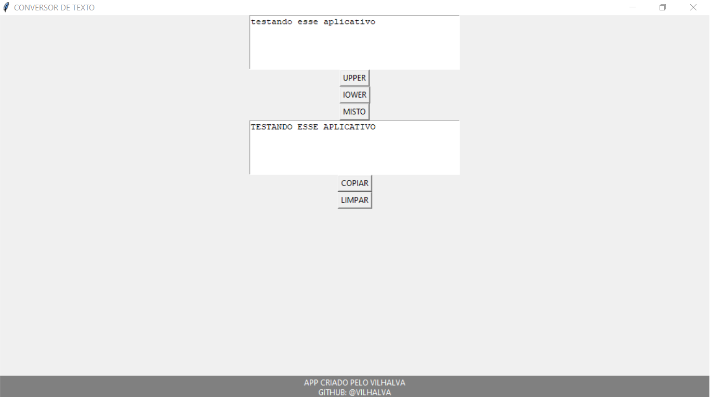

# FORMULÁRIO UPPER E LOWER
🎈CONVERTA SEU TEXTO PARA UPPER, LOWER OU MISTO.

 <br>

## DESCRIÇÃO:
O "Aplicativo de Formulário UPPER, LOWER e MISTO" é uma ferramenta simples, porém útil, desenvolvida em Python com o uso da biblioteca Tkinter para criar uma interface gráfica de usuário. O aplicativo oferece uma maneira conveniente de formatar e manipular texto, permitindo que os usuários convertam o texto para letras maiúsculas, minúsculas ou ambas, copiem o texto formatado para a área de transferência e limpem os campos de texto quando necessário.

## RECURSOS:
1. **Entrada de Texto Flexível:** O aplicativo fornece uma área de entrada de texto onde os usuários podem inserir ou colar texto de sua escolha. A entrada de texto é flexível e acomoda parágrafos ou texto simples.

2. **Conversão para Maiúsculas, Minúsculas ou Misturado:** O aplicativo oferece três botões distintos, "UPPER", "lOWER" e "MISTO", que permitem aos usuários converter o texto inserido para letras maiúsculas, minúsculas ou misturado (Apenas a primeira letra inicial de cada palavra fica maiúscula), respectivamente. Isso é útil para padronizar o texto ou realizar formatação de acordo com as necessidades do usuário.

3. **Visualização do Texto Formatado:** O texto formatado após a conversão é exibido em uma área designada, onde os usuários podem revisar o resultado. Isso torna fácil verificar se o texto foi convertido de acordo com as preferências do usuário.

4. **Cópia Simples para a Área de Transferência:** O aplicativo oferece a capacidade de copiar o texto formatado diretamente para a área de transferência do sistema com um simples clique no botão "COPIAR". Isso é conveniente quando os usuários desejam colar o texto em outros aplicativos ou documentos.

5. **Limpeza Fácil dos Campos:** O botão "LIMPAR" permite que os usuários limpem tanto o campo de entrada de texto quanto o campo de texto formatado, facilitando a preparação para a entrada de novo texto ou a realização de novas conversões.

Este aplicativo é valioso para qualquer pessoa que trabalhe frequentemente com texto e deseje uma maneira rápida e eficaz de formatar o texto conforme necessário. Ele economiza tempo e esforço, eliminando a necessidade de realizar conversões manualmente ou abrir aplicativos de edição de texto mais complexos.

## COMO USAR?
**Passo 1:** Clone o repositório para o seu sistema local.

```bash
git clone https://github.com/VILHALVA/FORMULARIO-UPPER-E-LOWER.git
```

**Passo 2:** Navegue até o diretório do projeto.

```bash
cd FORMULARIO-UPPER-E-LOWER
```

**Passo 3:** Descompacte o arquivo ZIP (se você baixou manualmente):

```bash
unzip FORMULARIO-UPPER-E-LOWER.zip
```

**Passo 4:** Execute o executável do projeto.

```bash
./FORMULARIO-UL
```

## CREDITOS:
- [PROJETO CRIADO PELO VILHALVA](https://github.com/VILHALVA)


